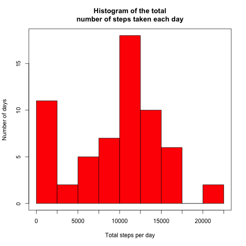
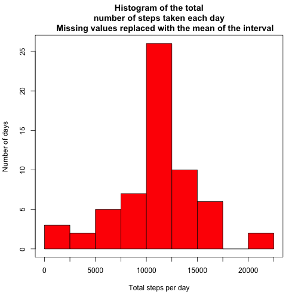
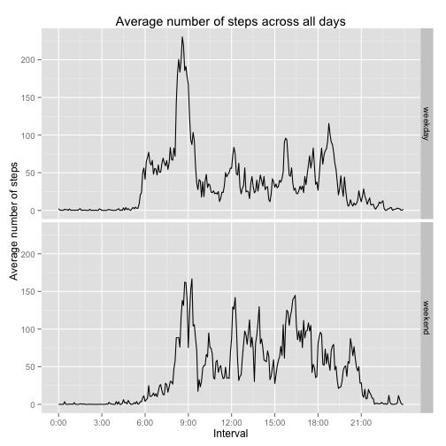

# Reproducible Research: Peer Assessment 1


## Loading and preprocessing the data

Show any code that is needed to

- 1. Load the data (i.e. `read.csv()`)

```r
zipfile <- "./activity.zip"
activity <- read.csv(unz(zipfile, "activity.csv"), colClasses = c(NA, "Date", NA))
```

- 2. Process/transform the data (if necessary) into a format suitable for your analysis

```r
activity$interval2 <- sapply(activity$interval, 
                     function(x) paste(c(rep("0",4-nchar(x)),x),sep="",
                                       collapse=""))
activity$interval2 <- strftime(strptime(activity$interval2, "%H%M"),"%H:%M")
```

## What is mean total number of steps taken per day?

For this part of the assignment, you can ignore the missing values in
the dataset.

- 1. Make a histogram of the total number of steps taken each day

```r
stepsday <- split(activity, activity$date)
stepsday1 <- sapply(stepsday, function(x) sum(x$steps, na.rm = TRUE))
histbreaks <- seq(0,22500,2500)
hist(stepsday1, breaks = histbreaks,
     main = "Histogram of the total\nnumber of steps taken each day", 
     xlab = "Total steps per day", ylab = "Number of days", col = "red",
     axes = FALSE)
labelsel <- histbreaks%%5000==0
labeltck <- histbreaks
labeltck[labelsel==FALSE]<-""
axis(1, at = histbreaks, labels = labeltck)
axis(2)
box()
```

 

- 2. Calculate and report the **mean** and **median** total number of steps taken per day

```r
stepsday2 <- mean(stepsday1, na.rm = TRUE)
stepsday3 <- median(stepsday1, na.rm = TRUE)
```

- Mean total number of steps taken each day: **9354**
- Median total number of steps taken each day: **10395**


## What is the average daily activity pattern?

- 1. Make a time series plot (i.e. `type = "l"`) of the 5-minute interval (x-axis) and the average number of steps taken, averaged across all days (y-axis)

```r
stepsinterval <- split(activity, factor(activity$interval2))
stepsinterval1 <- sapply(stepsinterval, function(x) mean(x$steps, na.rm = TRUE))
intervals1 <- strptime(names(stepsinterval1), "%H:%M")
plot(intervals1,stepsinterval1, type = "l",
     main = "Average number of steps across all days",
     xlab = "Interval", ylab = "Average number of steps")
```

 

- 2. Which 5-minute interval, on average across all the days in the dataset, contains the maximum number of steps?

```r
intmaxsteps <- names(stepsinterval1)[which(stepsinterval1==max(stepsinterval1))]
```

- 5-minute interval that contains on average across all the days in the dataset, the maximum number of steps: **08:35**

## Imputing missing values

Note that there are a number of days/intervals where there are missing
values (coded as `NA`). The presence of missing days may introduce
bias into some calculations or summaries of the data.

- 1. Calculate and report the total number of missing values in the dataset (i.e. the total number of rows with `NA`s)

```r
missingvalues <- sum(is.na(activity$steps))
```

Total number of missing values in the dataset: **2304**

- 2. Devise a strategy for filling in all of the missing values in the dataset. The strategy does not need to be sophisticated. For example, you could use the mean/median for that day, or the mean for that 5-minute interval, etc.

```r
## replace NA values with the mean for the respective 5-minute interval
fillmissingvalues <- function (x) { 
        ifelse(is.na(x[1]), stepsinterval1[x[4]], x[1])     
}
```

- 3. Create a new dataset that is equal to the original dataset but with the missing data filled in.

```r
activity2<-activity
activity2$steps <- as.numeric(apply(activity2, 1, fillmissingvalues))
```

- 4. Make a histogram of the total number of steps taken each day and Calculate and report the **mean** and **median** total number of steps taken per day. Do these values differ from the estimates from the first part of the assignment? What is the impact of imputing missing data on the estimates of the total daily number of steps?

```r
stepsday <- split(activity2, activity2$date)
stepsday1 <- sapply(stepsday, function(x) sum(x$steps))
histbreaks <- seq(0,22500,2500)
hist(stepsday1, breaks = histbreaks,
     main = "Histogram of the total\nnumber of steps taken each day
     Missing values replaced with the mean of the interval", 
     xlab = "Total steps per day", ylab = "Number of days", col = "red",
     axes = FALSE)
labelsel <- histbreaks%%5000==0
labeltck <- histbreaks
labeltck[labelsel==FALSE]<-""
axis(1, at = histbreaks, labels = labeltck)
axis(2)
box()
```

 


```r
stepsday4 <- mean(stepsday1)
stepsday5 <- median(stepsday1)
```

- **Missing values replaced with the mean of the respective 5-minute interval**
- Mean total number of steps taken each day: **10766**
- Median total number of steps taken each day: **10766**

The mean and median values differ from the estimates from the first part of the assignment: 
- Mean value difference: **+ 15%**
- Median value difference: **+ 3%**

The impact of imputing missing data on the estimates of the total daily number of steps was to reduce the number of days when fewer steps were recorded. The normal distribution seems to fit the revised data set, and the mean and median values are similar. 


## Are there differences in activity patterns between weekdays and weekends?

For this part the `weekdays()` function may be of some help here. Use
the dataset with the filled-in missing values for this part.

- 1. Create a new factor variable in the dataset with two levels -- "weekday" and "weekend" indicating whether a given date is a weekday or weekend day.

```r
weekperiod <- function (x) { 
        date <- strptime(x["date"], "%Y-%m-%d")
        ifelse(length(grep("^[Ss]",weekdays(date)))==0, "weekday", "weekend")     
}
activity2$period <- apply(activity2, 1, weekperiod)
activity2$period <- factor(activity2$period)
```

- 2. Make a panel plot containing a time series plot (i.e. `type = "l"`) of the 5-minute interval (x-axis) and the average number of steps taken, averaged across all weekday days or weekend days (y-axis). 

```r
library(reshape2)
library(ggplot2)

stepsinterval <- melt(activity2[,c(1,4,5)], id=c("period","interval2"))
stepsinterval1 <- dcast(stepsinterval, period + interval2 ~ variable, mean)

stepsinterval1$intplot <- as.POSIXct(stepsinterval1$interval2, format = "%H:%M")
stepsinterval1$intplot <- as.numeric(stepsinterval1$intplot - trunc(stepsinterval1$intplot, "days"))

timeHM_formatter <- function(x) {
    h <- floor(x/3600)
    m <- floor((x %% 3600)/60)
    lab <- sprintf('%02d:%02d', h, m)         # Format the strings as HH:MM
    lab <- gsub('^0', '', lab)                # Remove leading 0 if present
}

p <- qplot(intplot,steps,data=stepsinterval1,geom = "line", facets = period ~.,   
      main = "Average number of steps across all days", xlab = "Interval",
      ylab = "Average number of steps") 
p + scale_x_continuous(breaks=seq(1, 86100, 10800), label=timeHM_formatter)
```

 
